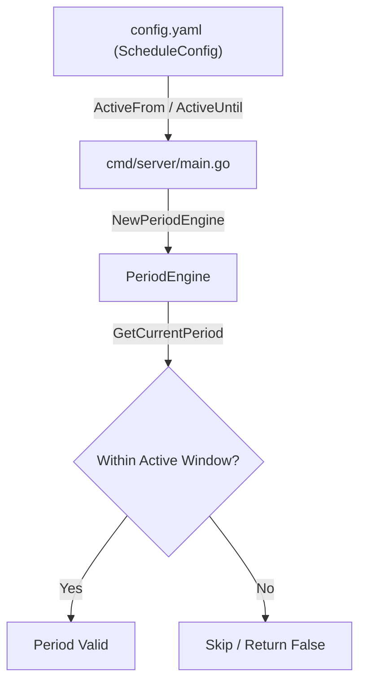

# Implementation Plan - Configurable Active Window in Period Engine

This document details the proposed changes to inject `ScheduleConfig.ActiveFrom` and `ScheduleConfig.ActiveUntil` into `PeriodEngine` so that active schedule windows are fully configurable rather than hardcoded to `06:00` – `23:00`.

---

## Goal Description
Currently, `PeriodEngine.GetCurrentPeriod(...)` in `internal/scheduler/period.go` hardcodes `activeFromM = 6 * 60` (06:00) and `activeUntilM = 23 * 60` (23:00). 

To give users full control over alert windows:
1. Update `NewPeriodEngine` signature to accept `activeFrom` and `activeUntil` strings (e.g. `"06:00"`, `"23:00"`), defaulting to `"06:00"` and `"23:00"` if omitted/empty.
2. Parse `activeFrom` and `activeUntil` in `NewPeriodEngine` into minute offsets (`activeFromM` and `activeUntilM`) stored within `PeriodEngine`.
3. Update `GetCurrentPeriod(...)` to evaluate window boundaries against stored `activeFromM` and `activeUntilM`.
4. Update `NewScheduler` in `internal/scheduler/scheduler.go` and `cmd/server/main.go` to pass `cfg.Schedule.ActiveFrom` and `cfg.Schedule.ActiveUntil`.

---

## Proposed Changes



---

### Component: `internal/scheduler`

#### [MODIFY] [period.go](file:///Users/halong/orca/workspaces/crypto-price-alert/main/internal/scheduler/period.go)
- Add `activeFromM` and `activeUntilM` int fields to `PeriodEngine` struct.
- Update `NewPeriodEngine(location *time.Location, activeFrom, activeUntil string) (*PeriodEngine, error)`:
  - If `activeFrom == ""` default to `"06:00"`.
  - If `activeUntil == ""` default to `"23:00"`.
  - Parse `"15:04"` format for both values and convert to minute of day (`hour*60 + minute`).
- Update `GetCurrentPeriod(...)` to use `e.activeFromM` and `e.activeUntilM` instead of hardcoded `6*60` and `23*60`.

#### [MODIFY] [period_test.go](file:///Users/halong/orca/workspaces/crypto-price-alert/main/internal/scheduler/period_test.go)
- Update `newTestEngine(t)` test helper to pass `"06:00"` and `"23:00"`.
- Add test cases verifying custom schedule windows (e.g. `"08:00"` to `"20:00"`).

#### [MODIFY] [scheduler.go](file:///Users/halong/orca/workspaces/crypto-price-alert/main/internal/scheduler/scheduler.go)
- Update `NewScheduler` to accept `activeFrom, activeUntil string` (or accept pre-constructed `*PeriodEngine` or pass active window settings to `NewPeriodEngine`).

#### [MODIFY] [scheduler_test.go](file:///Users/halong/orca/workspaces/crypto-price-alert/main/internal/scheduler/scheduler_test.go)
- Update `NewScheduler` calls in unit tests.

#### [MODIFY] [target_executor_test.go](file:///Users/halong/orca/workspaces/crypto-price-alert/main/internal/scheduler/target_executor_test.go)
- Update `NewPeriodEngine` calls in unit tests to pass active window strings (or `"06:00"`, `"23:00"`).

---

### Component: `internal/api`

#### [MODIFY] [handler_test.go](file:///Users/halong/orca/workspaces/crypto-price-alert/main/internal/api/handler_test.go)
- Update `NewPeriodEngine` call in test helper `testDeps`.

---

### Component: `cmd/server`

#### [MODIFY] [main.go](file:///Users/halong/orca/workspaces/crypto-price-alert/main/cmd/server/main.go)
- Pass `cfg.Schedule.ActiveFrom` and `cfg.Schedule.ActiveUntil` to `scheduler.NewPeriodEngine(...)` and `scheduler.NewScheduler(...)`.

---

## Verification Plan

### Automated Tests
Run full unit test suite:
```bash
go test -v ./internal/scheduler/...
go test -v ./...
```

### Manual Verification
1. Modify `configs/config.yaml` with custom window e.g. `active_from: "08:00"`, `active_until: "20:00"`.
2. Start server and verify periods outside 08:00–20:00 are skipped.
