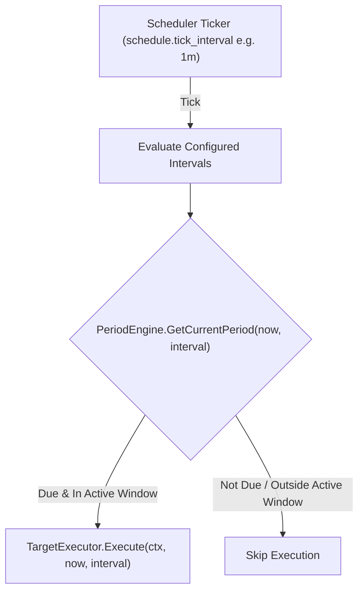

# Implementation Plan - Flexible Multi-Interval Support

_Assistant_: agy

This document proposes an enhancement to support arbitrary/multiple timeframe intervals (e.g., `15m`, `30m`, `1h`, `2h`, `4h`, `6h`, `8h`, `12h`, `1d`, etc.) driven by a single configurable ticker in `config.yaml`.

---

## Goal Description
Currently, the system is hardcoded to support only `1h` and `4h` intervals. The scheduler registers explicit static cron expressions (`0 * * * *` for `1h`, and `0 11,15,19,23 * * *` for `4h`). 

To support multiple configurable intervals (such as `15m`, `30m`, `2h`, `6h`, `12h`, `1d`):
1. **Configurable Cron Ticker Engine**: Instead of registering a separate cron job for each interval, the scheduler reads `schedule.tick_interval` from `config.yaml` (defaulting to `"1m"`) to run a single evaluation ticker. On each tick, it evaluates all configured intervals to check if any interval boundary is hit.
2. **Generalized Period Engine**: Replace hardcoded `switch` logic for `1h`/`4h` with generic UTC-aligned boundary calculations and active-schedule window checks for any supported interval duration.
3. **Dynamic Configuration & Validation**: Expand `domain.Interval` and `config.Config` validation to support standard crypto exchange kline intervals (`1m`, `3m`, `5m`, `15m`, `30m`, `1h`, `2h`, `4h`, `6h`, `8h`, `12h`, `1d`, `3d`, `1w`).

---

## User Review Required

> [!IMPORTANT]
> **Configurable Ticker (`schedule.tick_interval`)**
> The scheduler uses `schedule.tick_interval` specified in `config.yaml` (default `"1m"`).
> - For `"1m"`, the scheduler registers `* * * * *` (every minute).
> - If set to `"15m"`, it registers `*/15 * * * *` (every 15 minutes).
> - On each tick, `PeriodEngine.GetCurrentPeriod(now, interval)` evaluates whether each active interval is due.

> [!NOTE]
> **UTC Alignment for Crypto Klines**
> Binance klines for sub-day timeframes are aligned to UTC Midnight (`00:00:00 UTC`). For instance:
> - `2h` boundaries in UTC: 00:00, 02:00, 04:00, ... 22:00. In `Asia/Ho_Chi_Minh` (UTC+7), boundaries are 01:00, 03:00, 05:00, 07:00, 09:00, 11:00, 13:00, 15:00, 17:00, 19:00, 21:00, 23:00.
> - `15m` boundaries: every 15 minutes (`:00`, `:15`, `:30`, `:45`).
> - `30m` boundaries: every 30 minutes (`:00`, `:30`).
>
> The generalized calculation automatically handles timezone offsets and active window filtering (`06:00` to `23:00`).

---

## Proposed Changes



---

### Component: `configs`

#### [MODIFY] [config.example.yaml](file:///Users/halong/orca/workspaces/crypto-price-alert/main/configs/config.example.yaml)
- Add `tick_interval: "1m"` under `schedule:`.

---

### Component: `internal/domain`

#### [MODIFY] [types.go](file:///Users/halong/orca/workspaces/crypto-price-alert/main/internal/domain/types.go)
- Add `Duration()` method to `domain.Interval` returning `(time.Duration, error)`.
- Update `Interval.Validate()` to check against supported kline intervals (`1m`, `3m`, `5m`, `15m`, `30m`, `1h`, `2h`, `4h`, `6h`, `8h`, `12h`, `1d`, `3d`, `1w`).
- Export additional standard interval constants (`Interval15M`, `Interval30M`, `Interval2H`, etc.).

#### [MODIFY] [types_test.go](file:///Users/halong/orca/workspaces/crypto-price-alert/main/internal/domain/types_test.go)
- Add unit tests for `Duration()` and expanded `Validate()` cases.

---

### Component: `internal/config`

#### [MODIFY] [config.go](file:///Users/halong/orca/workspaces/crypto-price-alert/main/internal/config/config.go)
- Add `TickInterval` string field to `ScheduleConfig` (`tick_interval: "1m"` by default).
- Update `Config.Validate()` for `ScheduleConfig` and `Market.Intervals` to validate `tick_interval` and support new intervals.

#### [MODIFY] [config_test.go](file:///Users/halong/orca/workspaces/crypto-price-alert/main/internal/config/config_test.go)
- Add test coverage for `schedule.tick_interval` parsing and default handling.

---

### Component: `internal/scheduler`

#### [MODIFY] [period.go](file:///Users/halong/orca/workspaces/crypto-price-alert/main/internal/scheduler/period.go)
- Generalize `GetCurrentPeriod(now time.Time, interval domain.Interval) (domain.Period, bool)`:
  1. Parse interval duration $D$ via `interval.Duration()`.
  2. Check if `now.UTC()` elapsed time since UTC Midnight is divisible by $D$.
  3. Construct `End = localNow` and `Start = End.Add(-D)`.
  4. Verify that `Start` and `End` in local time fall within the active schedule window (`06:00` to `23:00`).

#### [MODIFY] [period_test.go](file:///Users/halong/orca/workspaces/crypto-price-alert/main/internal/scheduler/period_test.go)
- Retain existing `1h` and `4h` boundary tests.
- Add test coverage for `15m`, `30m`, `2h`, `6h`, and `1d` intervals.

#### [MODIFY] [scheduler.go](file:///Users/halong/orca/workspaces/crypto-price-alert/main/internal/scheduler/scheduler.go)
- Convert `tick_interval` to cron expression (e.g., `"1m"` -> `* * * * *`, `"15m"` -> `*/15 * * * *`).
- In `Start()`, register the single cron job based on `tick_interval`.
- On each tick, loop through configured intervals, check `PeriodEngine.GetCurrentPeriod`, and execute if due.

#### [MODIFY] [scheduler_test.go](file:///Users/halong/orca/workspaces/crypto-price-alert/main/internal/scheduler/scheduler_test.go)
- Add unit test for `Scheduler` with configurable `tick_interval`.

---

### Component: `cmd/server`

#### [MODIFY] [main.go](file:///Users/halong/orca/workspaces/crypto-price-alert/main/cmd/server/main.go)
- Pass `cfg.Schedule.TickInterval` and `cfg.Market.Intervals` into `scheduler.NewScheduler(...)`.

---

## Verification Plan

### Automated Tests
Run existing and new Go unit tests across all packages:
```bash
go test -v ./internal/domain/...
go test -v ./internal/config/...
go test -v ./internal/scheduler/...
go test -v ./internal/service/...
go test -v ./...
```

### Manual Verification
1. Start the server with `tick_interval: "15m"` in `configs/config.yaml`.
2. Inspect startup logs ensuring scheduler registers ticker cron `*/15 * * * *`.
3. Verify via Slack/Telegram chat interface that `/config` displays allowed intervals as toggleable options.
